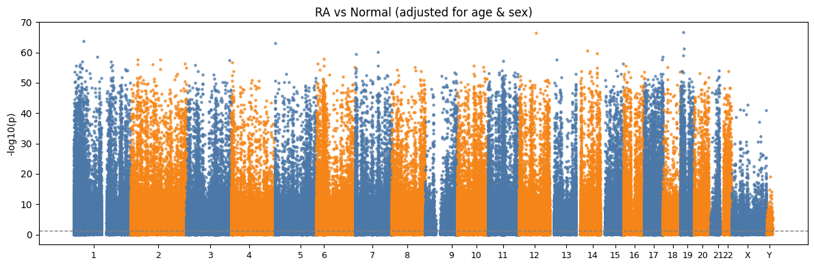
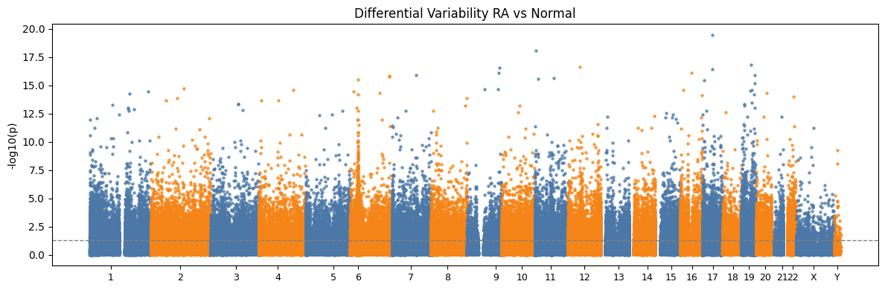

# Purpose
This repo contains a notebook that analyzes Illumina 450k whole-blood DNA methylation from GSE42861 to test how Rheumatoid Arthritis (RA) relates to genome-wide methylation.

Using Biolearn's DataLibrary, methylation beta values and metadata are loaded and then aligned for the following analysis:

1) **RA association (EWAS):** Ordinary Least Squares (OLS) models: beta ~ RA + age + sex, to identify CpGs differentially methylated in RA
2) **Differential variability (DV):** Brown–Forsythe tests to find CpGs with altered methylation variance

# Visualization

For visualization CpG was mapped to chromosome/position for creating genome-wide Manhattan plots:
- RA association Manhattan: –log10(p_RA) across the genome

- DV Manhattan: –log10(p_DV) for variance differences

# Interpretation
Top RA-associated loci include SMARCA4 and KLF2 (chr19, chromatin remodeling and immune regulation), S1PR1 (chr1, lymphocyte trafficking), and PTPRCAP/LY9 (immune signaling). DV analysis shows additional immune-pathway CpGs with genes like MRGPRG, FAM113B, and MICA, suggesting RA-related epigenetic instability.
